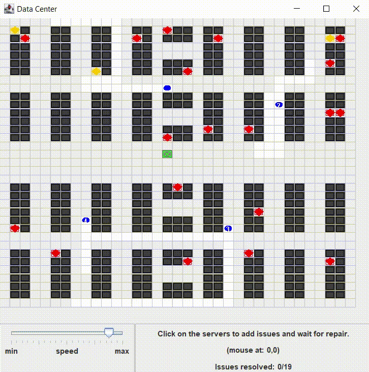

# MAS Data Center

This projecta contains a Multi-Agent System (MAS) that simulates the data center environment.

It's my term project for the course Multi-Agent Systems of the PUCRS.

## Prerequisites

- JaCaMo environment ([see more](http://jacamo.sourceforge.net/))

## Demo

## How to run

If you are using Eclipse (with JaCaMo plugin), you can run the project double-clicking on the [mas_data_center.jcm](mas_data_center.jcm) file and selecting the "Run JaCaMo Application" menu.

## Changelog

See the [GitHub Tags](https://github.com/DougTrajano/pucrs-mas-data-center/tags) for a history of notable changes to this project.

## License

This software is licensed under the Apache 2.0 [LICENSE](LICENSE) © [DougTrajano](https://github.com/DougTrajano). 2021
