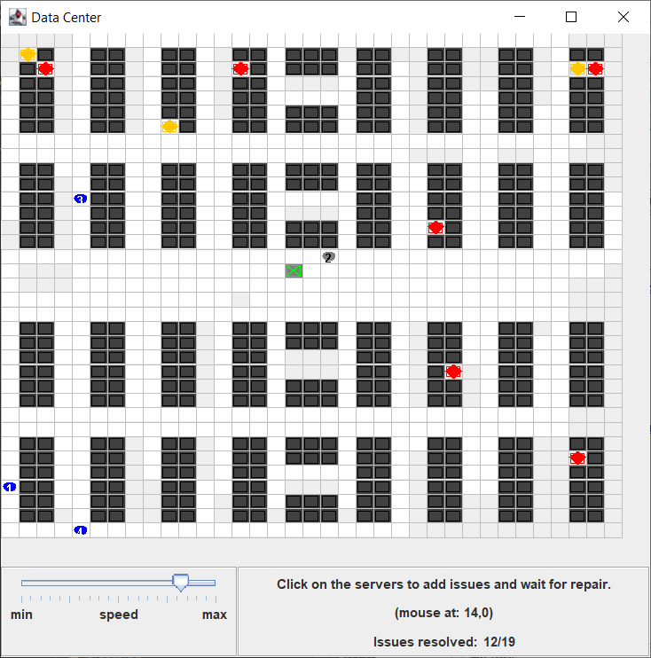
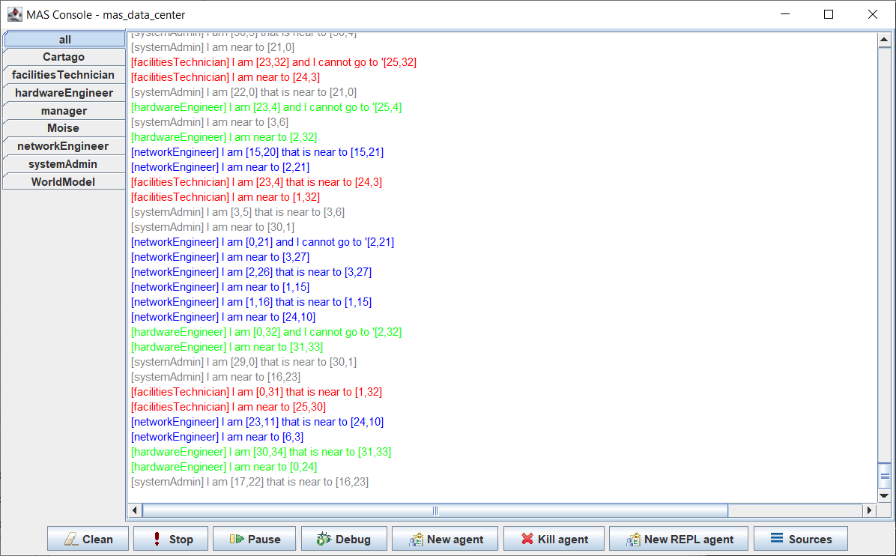
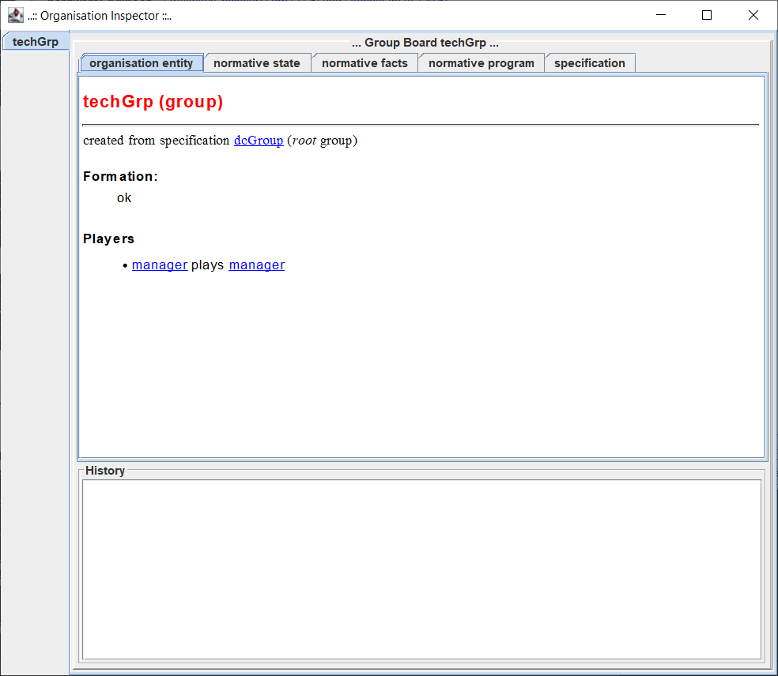

# MAS Data Center

This project contains a Multi-Agent System (MAS) that simulates the data center environment.

It's my term project for the Multi-Agent Systems course at [PUCRS](https://www.pucrs.br/).

## Prerequisites

- JaCaMo environment ([see more](http://jacamo.sourceforge.net/))

## Demo

## Screens

### World

In this window, we can see our environment as a grid of cells.

- **Red**: Hardware issues.
- **Orange**: Software issues.
- **Dark Gray**: Servers.
- **White**: Free cells visited by the agents.
- **Light Gray**: Free cells unvisited by the agents.
- **Green**: Command Center

The agents can move in the grid, when they are free they will be colored in blue, when they are carrying a hardware component or software they will be colored in gray.

### Logs

In this window, we can see the logs of each agent, the world, the manager, and so on.

### Organisation Inspector

In this window, we can see the organisation of the agents.

## How to run

If you are using Eclipse (with JaCaMo plugin), you can run the project double-clicking on the [mas_data_center.jcm](mas_data_center.jcm) file and selecting the "Run JaCaMo Application" menu.

## Changelog

See the [GitHub Tags](https://github.com/DougTrajano/pucrs-mas-data-center/tags) for a history of notable changes to this project.

## License

This software is licensed under the Apache 2.0 [LICENSE](LICENSE) © [DougTrajano](https://github.com/DougTrajano). 2021